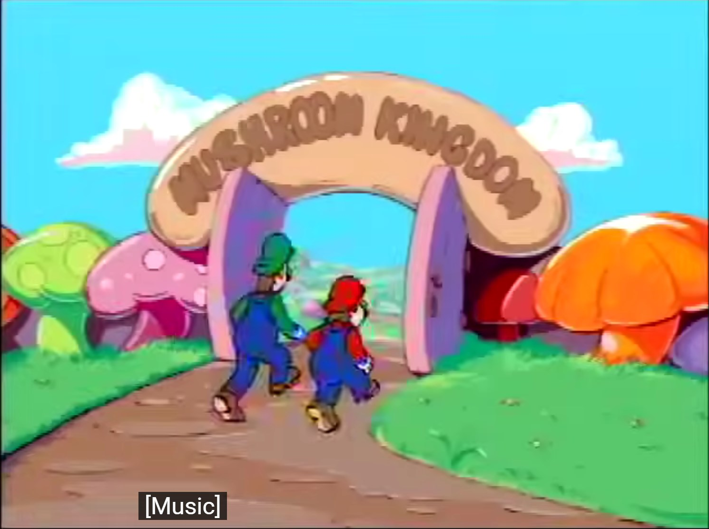
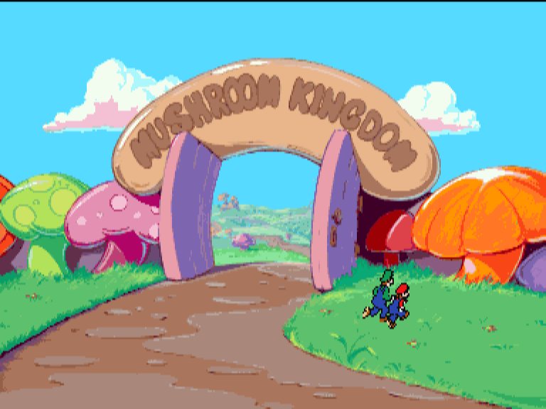
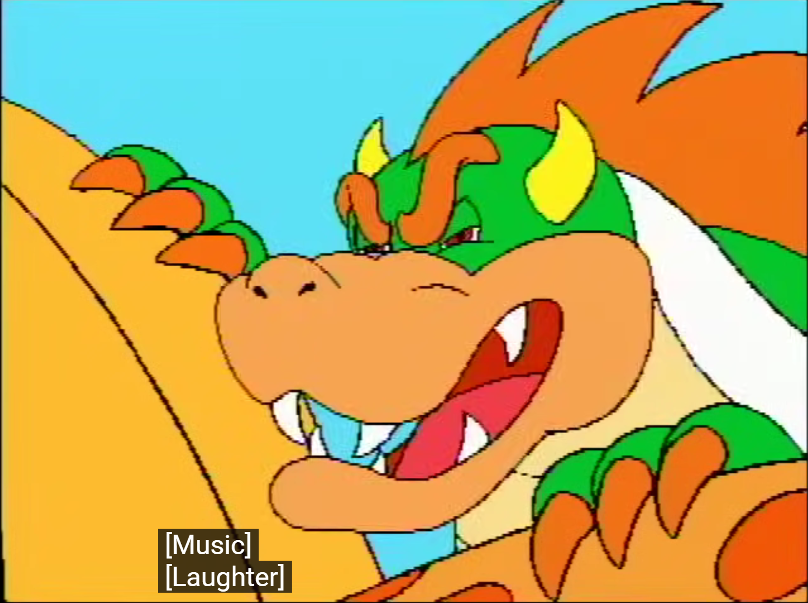
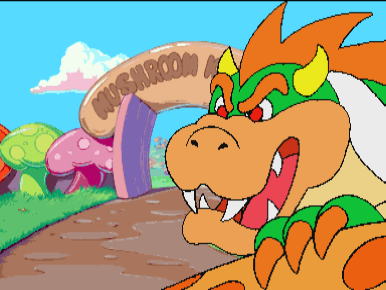
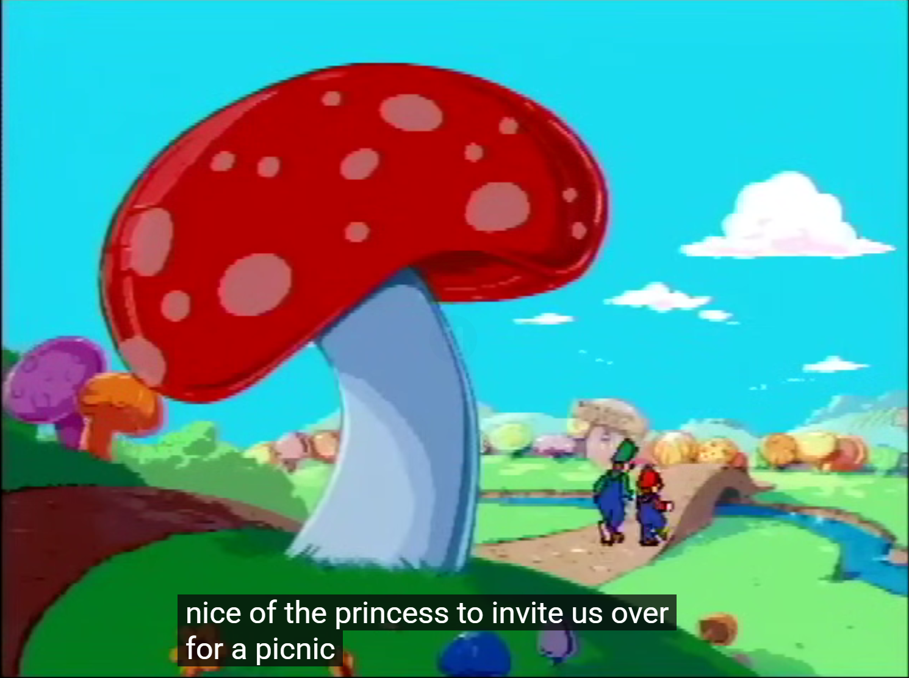
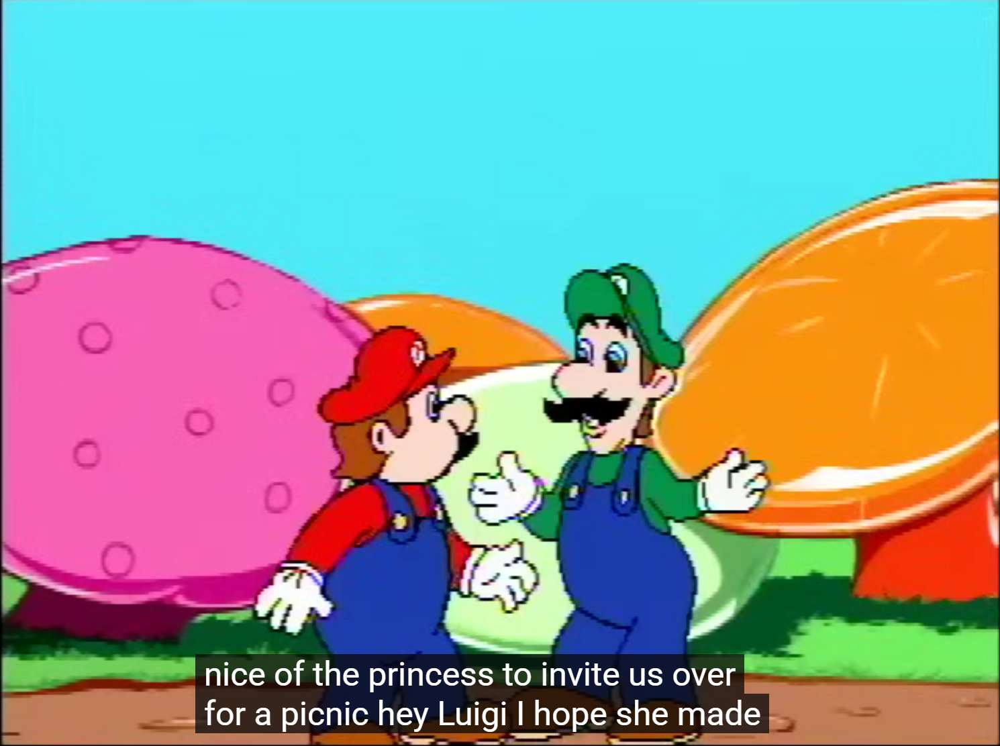
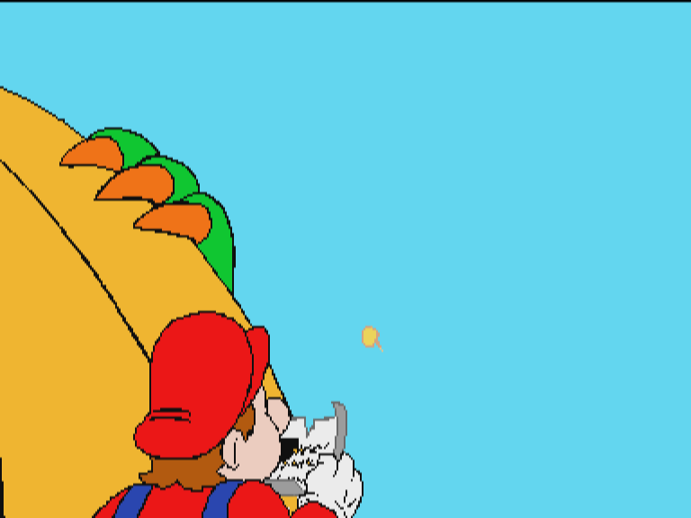

# Known Issues

Current as of `5687e32` (2026-07-31). The first issue is the headline
defect; the others gate or compound it. Investigation breadcrumbs live in
the session notes referenced at the bottom.

---

## 1. Intro cutscene: scene backgrounds transition late, then stop updating

**The character/cel animation stream advances on schedule, but the scene
background stills lag one or more scenes behind — and partway through the
intro they stop updating entirely, leaving later scenes on a bare sky-blue
plane.**

Reference footage (real hardware capture, "Hotel Mario - All Cutscenes")
vs. this recompiler, same scenes:

| Real hardware | This recomp | Defect |
| --- | --- | --- |
|  |  | Gate scene: **correct** (background matches). |
|  |  | Bowser's laugh should play against the yellow Klub Koopa wall with his claw on it. We show him over the **stale scene-1 path/gate background**. |
|  |  | The "nice of the princess" walk should pass a big red mushroom with bridge scenery. We keep the **stale gate background** under the new cels. |
|  |  | The Mario/Luigi talk scene should sit against full mushroom-cap scenery. We show the cels over a **bare cyan plane** — the background never arrived at all. |

Additional symptom: single torn frames at scene cuts (old background with
the next scene's cels already drawn over it) — the cel cut lands before
the background swap.

**Prime suspect** (decoded but not yet run down): the game's display
hookup callback (`$260A94` in the game module) gates each background
page-flip on a per-record "displayed" flag (`$498(a0)`) that is set by a
video-line callback from the game's `I$SetStt $56` line-event/UCM
subscriptions. If the runtime's MCD212/UCM line-event delivery fires
those callbacks late or not at all, every background swap queues behind
the wait while the ungated cel stream keeps cutting — exactly the
observed lag-then-stop.

**How to investigate:** the `video_plane` debug command (added in
`5687e32`; `tools/session-probes/plane_dump.py`) dumps plane A, plane B,
and the per-pixel composition verdict independently of the composed
output — watch plane B content against the scene cuts, and trace the
`$56`-subscription callback delivery.

---

## 2. Stage entry never completes: no Mario, timer frozen (demo + 1 Player)

Entering any stage (attract demo or 1 PLAYER) draws the stage backdrop
and HUD, but Mario never spawns and TIME stays frozen at 200. The
stage-entry cutscene (hotel facade → Mario & Luigi walk in → Bowser
laughs) never plays.

Measured root: the stage-entry play selects channel 14 (entry/stage
audio) and arms the CIAP in locator mode (`CCR $0044`) **without the
`$C4` re-arm that every working attract play performs**. Locator
reporting then persists through the whole play; nothing in that ROM phase
acknowledges the locator buffer pair, so the driver's buffer picker
(`$4292F0`) finds a "ready locator" ahead of the data buffer on every
interrupt and the record engine never consumes. The ch14 record's
end-of-record sector (LBA 45221) is delivered but never consumed; the
play never completes; the game waits forever.

Fix direction: decode who acknowledges the Q pair in the real `$0044`
flow (most likely locator reporting should stop at the handover rather
than persist through the play), then correct the `q_reporting` lifecycle
in `runner/src/cdic.c`.

This one flow gates: the demo, the attract loop (which is what rotates
the title-screen background between cycles), and 1-Player play.

---

## 3. Racy load wedge after "Play CD-I" (black screen)

Roughly a third to half of launches — much more often in windowed mode
than headless — the game load parks forever at LBA 2273/2274 or 3219
with an un-acknowledged CIAP buffer: black screen, drive holding, game
polling. No recovery except relaunch.

Shape: after an op's completion teardown (`CCR $0100`), the deferred IKAT
`C4` resume restarts the transport; a sector delivers while the ROM is
idle (its ISR reads and ignores the announcement — the ISR is
acknowledge-on-read); once both buffers end up host-owned the transport
holds and the next op starves.

Three model-level fixes were attempted and reverted (hold-only-while-
engaged; locator interrupts; overwrite-oldest) — each moved the failure
instead of fixing it. The real fix needs the same ROM-phase decode as
issue 2: when the transport must hold vs. stream vs. report locators,
per driver phase. Full experiment record in the session notes.

---

## 4. Racy boot crash (wild jump during CD-i shell boot)

Occasionally (more often in windowed mode) the BIOS boot crashes ~7M
instructions in with a wild jump out of the ROM's IKAT command
serializer (`$42B2Fx` → unmapped address, garbage pointer while
serializing a `C4` command). Same timing-race family as issue 3.

---

## Cross-references

- Investigation notes/history: this repo's commit messages for `bab3d68`
  (CIAP double-buffering, delivery-honest re-selection poke, audio record
  events) and `5687e32` (per-plane composition snapshots), plus
  `.claude/GOAL.md` in working trees where present.
- Reference frames in `docs/issues/` are cropped stills from a real
  console capture, included for engineering comparison.
