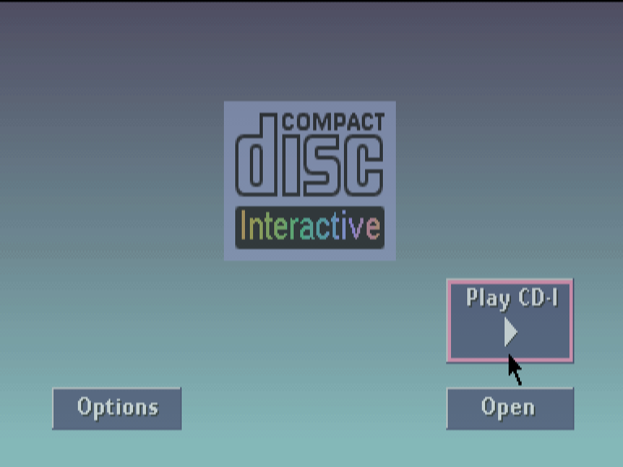
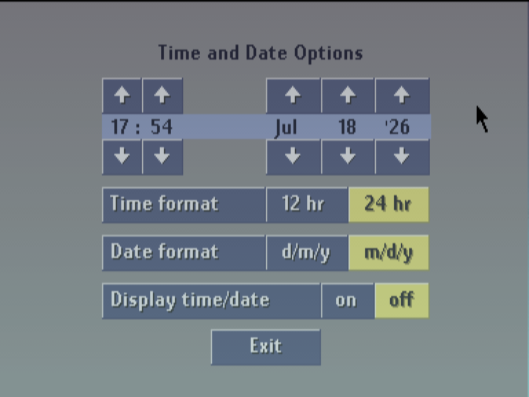
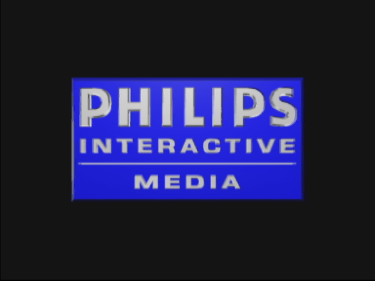
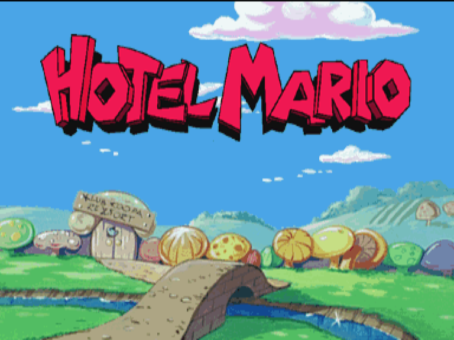

# cdirecomp — a Philips CD-i static recompiler

> ### ⚠️ Very early development
> This project boots the real Philips CD-i **system ROM** as native code and can
> perform a **very basic boot of a CD-i title** — *Hotel Mario* reaches its
> title card. **Gameplay is not yet reachable.** Expect rough edges, missing
> features, incomplete hardware coverage, and breaking changes. This is a
> research project shared in the open, not a finished product — and it is a
> static recompiler, **not an emulator**.

**cdirecomp** is a **static recompiler** for the **Philips CD-i**. It lifts the
console's **Motorola 68000-family** machine code (CPU: **SCC68070**) into
portable **C**, then links that generated C against a hand-written runtime that
re-creates the rest of the machine — the **MCD212** video decoder, the
**CDIC / CIAP** CD + XA-audio path, and the **SLAVE / IKAT** input controller —
and runs the console's **CD-RTOS / OS-9** operating system on top.

It shares the two-tier structure and spirit of the sibling projects
[`nesrecomp`](https://github.com/mstan), `snesrecomp`, `segagenesisrecomp`, and
`psxrecomp`.

<p align="center">
  
  &nbsp;
  
</p>
<p align="center">
  
  &nbsp;
  
</p>
<p align="center">
  <sub>Real CD-RTOS player shell · Time/Date settings · the Philips Interactive Media
  bumper · and <i>Hotel Mario</i> reaching its title card — all running as native
  recompiled code.</sub>
</p>

## Philosophy: low-level, static, native-first

The guiding inspiration for cdirecomp is to be **LLE (low-level emulation) and
static / native-first**:

- **Low-level, not HLE.** There is **no hand-written OS-9 HLE layer.** The whole
  **CD-RTOS system ROM is recompiled and executed** as native C. A game's
  `TRAP #0` OS-9 system calls dispatch into the *recompiled* kernel, and kernel
  state lives in emulated RAM exactly as it does on hardware. Only the hardware
  chips are modeled by hand. (psxrecomp showed that stubbing the BIOS leads to
  silent failure; CD-i takes the opposite, faithful route.)
- **Static, not interpreted.** The 68000 code is translated **ahead of time to
  C** and compiled to a native binary. A clean-room interpreter is kept only as
  the correctness floor for RAM-resident / not-yet-statically-promoted code.

### Why CD-i is unusual

The Genesis runs a bare-metal 68000 cartridge; **CD-i does not.** A CD-i title
is a Green Book **Mode-2 CD** whose data track holds a CD-i/ISO-9660 file
system. The program is a set of **OS-9/68000 relocatable modules** (sync word
`0x4AFC`) that **CD-RTOS** — a real-time OS based on Microware OS-9/68K — loads
and relocates into RAM at run time, reaching the system through `TRAP #0`
system calls. So cdirecomp recompiles and executes the whole player **system
ROM first**, then lets the game boot on top of it.

## Current status

What works today:

- **Boots the real CD-RTOS system ROM** (user-supplied) to its interactive
  **player shell** — navigation, the Time/Date and storage settings UIs, media
  insert/eject, and persistence — running as native recompiled code.
- **Very basic Hotel Mario boot.** From the shell you can *Play CD-I* a
  user-supplied *Hotel Mario (USA)* disc; CD-RTOS loads the title, the Philips
  Interactive Media bumper plays with decoded XA audio, and the game reaches its
  **title card** with zero native dispatch misses.
- **Real-time clock (RTC) on Windows.** The runtime can seed the CD-i's DS1216
  real-time clock from your **Windows host clock** once at startup (opt-in), and
  the player's on-screen **Time & Date** settings screen is functional.
- **Working mouse control on Windows.** The host mouse drives the CD-i pointer
  directly through the runtime's IKAT input model — **including inside Hotel
  Mario**, not just the shell.
- **Clean-room device models** for the MCD212 video pipeline (bitmap, CLUT,
  RGB555, DYUV, RL7/RL3, mosaic, transparency/matte compositing, cursor), the
  CDIC/CIAP CD + XA audio path, and IKAT input — rewritten from hardware
  documentation, with an optional local emulator used only as a black-box
  behavioral comparator during development.

What is **not** done yet:

- **Gameplay is not reachable.** Static native promotion of relocated game
  modules, and full-playthrough certification, are open work.
- Broader title compatibility beyond the current Hotel Mario bring-up.
- Unexercised I2C/MMU paths and additional exception cases remain platform
  backlog, driven by real applications as they are brought up.

See `TODO.md`, `PLAN.md`, and `BIOS-CLOSEOUT.md` for the detailed roadmap and the
BIOS/player-shell milestone evidence.

## What you must supply

cdirecomp ships **no copyrighted material** — no BIOS ROM, no disc images, and
no game-derived generated code. To run anything you must provide, from your own
legally dumped media:

- A CD-i player **system ROM** (e.g. a 512 KiB `cdi490a.rom`).
- A CD-i title as a raw **Mode-2 `.cue` + `.bin`** image.

## Build

Toolchain: **CMake** + a **C11** compiler + the **SDL2** development package.
Builds with Visual Studio 17 2022, and is also verified with MinGW gcc + Ninja.

```powershell
# Recompiler (CdiRecomp) — 68000 frontend + CD-i disc/module inventory
cmake -S recompiler -B build/recompiler -G Ninja -DCMAKE_BUILD_TYPE=Release
cmake --build build/recompiler -j

# Recompile the CD-RTOS system ROM to C (emit generated BIOS)
build/recompiler/CdiRecompBios.exe bios/cdi490a.rom --emit

# Runtime (CdiRuntime) — hardware models + native/interpreted guest execution
cmake -S runner -B build/runner-release -G Ninja -DCMAKE_BUILD_TYPE=Release
cmake --build build/runner-release -j
```

## Run

```powershell
# Inventory a CD-i disc: tracks, volume descriptor, OS-9 modules
build/recompiler/CdiRecomp.exe "path/to/Game (Region).cue"

# Boot the user-supplied system ROM to the player shell
build/runner-release/CdiRuntime.exe bios/cdi490a.rom

# Boot with a Mode-2 disc mounted; click "Open" then "Play CD-I" in the shell
build/runner-release/CdiRuntime.exe bios/cdi490a.rom --disc "path/to/Game.cue"
```

**Controls:** the **mouse** moves the CD-i pointer (and clicks its buttons);
arrows/WASD also move it; Enter/Space/Z is button 1; Backspace/X is button 2;
F11 or Alt+Enter toggles fullscreen; Esc exits. A standard game controller maps
D-pad/A/B. Dropping a `.cue`/`.bin` onto the window mounts media live.

### Persistent player preferences

A normal run creates `player.cfg` in SDL's per-user preference folder (its path
is printed at startup). Two opt-in preferences, both **off by default**:

```ini
[input]
capture_mouse = true          ; hide + capture the host cursor while focused

[rtc]
sync_host_on_startup = true   ; seed the CD-i clock from host time once at boot
```

`capture_mouse` maps relative host-mouse motion and the left/right buttons to
the CD-i pointer and buttons 1/2; focus loss or Esc releases it immediately.
`sync_host_on_startup` copies host-local time into the DS1216 only before the
first guest instruction — it never continuously re-syncs. A normal run also
maintains `nvram.bin` (the DS1216's battery-backed SRAM) beside `player.cfg`.

## Provenance & third-party code

The 68000 frontend descends from the author's own `segagenesisrecomp`; the CD-i
device models are clean-room rewrites from hardware specifications. No
third-party emulator source is used in the recompiler or runtime. An optional
CeDImu checkout may be used locally as a black-box behavioral oracle only — it is
git-ignored and never committed, packaged, or required. See `PROVENANCE.md` and
`THIRD-PARTY-NOTICES.md` (SDL2).

## License

[PolyForm Noncommercial License 1.0.0](LICENSE) — © 2026 Matthew Stan. This
license covers the cdirecomp source only. It grants no rights to any Philips,
Nintendo, or other third-party intellectual property; you must supply your own
legally obtained system ROM and disc images.

---

<p align="center">
  <sub><b>R.A.I.D. — Retro AI Development</b> · a Discord for AI-assisted retro reverse-engineering, decomp &amp; recomp</sub>
</p>

<p align="center">
  <a href="https://discord.gg/Ad9BwSzctP"></a>
</p>
