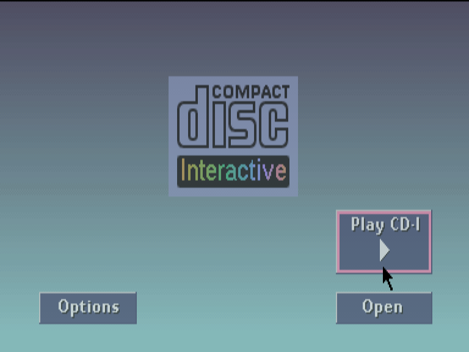
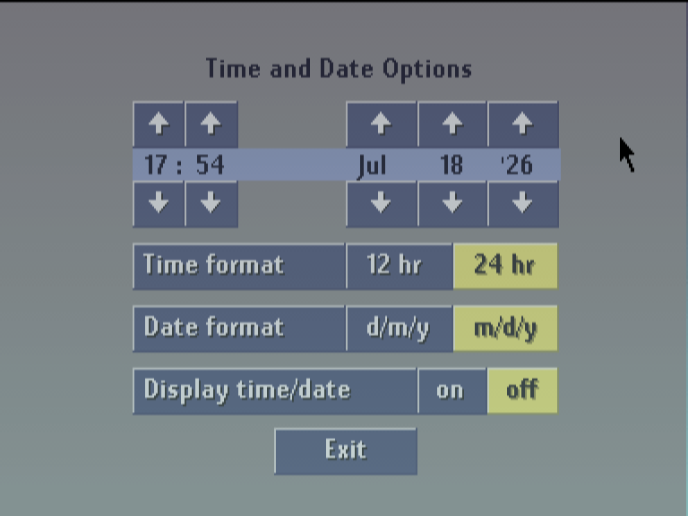
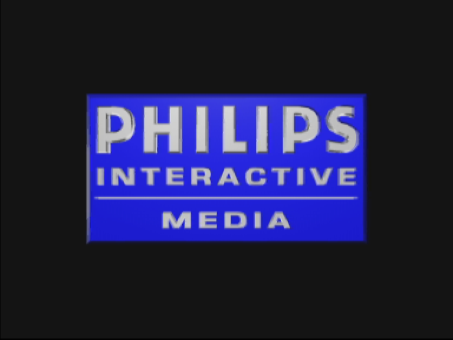

# cdirecomp — a Philips CD-i static recompiler

> ### ⚠️ Very early development
> This project boots the real Philips CD-i **system ROM** as native code and can
> run the early stages of *Hotel Mario* through the real OS-9 drivers.
> Normal-speed input has cleared **Hotel 1 Stages 1–3**, reaching Stage 4.
> Full campaigns, bosses, the ending and correct save restoration remain
> unverified. Expect rough edges, missing
> features, incomplete hardware coverage, and breaking changes. This is a
> research project shared in the open, not a finished product — and it is a
> static recompiler, **not an emulator**.

**cdirecomp** is a **static recompiler** for the **Philips CD-i**. It lifts the
console's **Motorola 68000-family** machine code (CPU: **SCC68070**) into
portable **C**, then links that generated C against a hand-written runtime that
re-creates the rest of the machine — the **MCD212** video decoder, the
**CDIC / CIAP** CD + XA-audio path, and the **SLAVE / IKAT** input controller —
and runs the console's **CD-RTOS / OS-9** operating system on top.

It shares the two-tier structure and spirit of the sibling projects
[`nesrecomp`](https://github.com/mstan), `snesrecomp`, `segagenesisrecomp`, and
`psxrecomp`.

<p align="center">
  
  &nbsp;
  
</p>
<p align="center">
  
  &nbsp;
  
</p>
<p align="center">
  <sub>Real CD-RTOS player shell · Time/Date settings · the Philips Interactive Media
  bumper · and <i>Hotel Mario</i> reaching its title card through the real
  recompiled system ROM.</sub>
</p>

## Philosophy: low-level, static, native-first

The guiding inspiration for cdirecomp is to be **LLE (low-level emulation) and
static / native-first**:

- **Low-level, not HLE.** There is **no hand-written OS-9 HLE layer.** The whole
  **CD-RTOS system ROM is recompiled and executed** as native C. A game's
  `TRAP #0` OS-9 system calls dispatch into the *recompiled* kernel, and kernel
  state lives in emulated RAM exactly as it does on hardware. Only the hardware
  chips are modeled by hand. (psxrecomp showed that stubbing the BIOS leads to
  silent failure; CD-i takes the opposite, faithful route.)
- **Static, not interpreted.** The 68000 code is translated **ahead of time to
  C** and compiled to a native binary. A clean-room interpreter is kept only as
  the correctness floor for RAM-resident / not-yet-statically-promoted code.

### Why CD-i is unusual

The Genesis runs a bare-metal 68000 cartridge; **CD-i does not.** A CD-i title
is a Green Book **Mode-2 CD** whose data track holds a CD-i/ISO-9660 file
system. The program is a set of **OS-9/68000 relocatable modules** (sync word
`0x4AFC`) that **CD-RTOS** — a real-time OS based on Microware OS-9/68K — loads
and relocates into RAM at run time, reaching the system through `TRAP #0`
system calls. So cdirecomp recompiles and executes the whole player **system
ROM first**, then lets the game boot on top of it.

## Current status

What works today:

- **Boots the real CD-RTOS system ROM** (user-supplied) to its interactive
  **player shell** — navigation, the Time/Date and storage settings UIs, media
  insert/eject, and persistence — running as native recompiled code.
- **Hotel Mario boot and early gameplay.** From the shell you can *Play CD-I* a
  user-supplied *Hotel Mario (USA)* disc; CD-RTOS loads the title, the Philips
  Interactive Media bumper plays with decoded XA audio, and the game reaches its
  **title card** and one-player gameplay. Intro background changes now follow
  the disc's file-wide trigger events. Windowed input and buffered XA playback
  reach gameplay through the real OS-9 drivers. Normal-speed controller input
  cleared Hotel 1 Stages 1–3 on the indexed LLE build. A separate seeded
  two-player build reached Stage 3 for Mario and Stage 5 for Luigi. These are
  partial playthrough observations using ordinary game input.
- **Owner playtest feedback (2026-10-09).** Basic gameplay and the title-screen
  background are reported working well. Minor visual flickering remains;
  its cause has not been investigated.
- **Static native OS-9 modules.** The disc frontend validates file extents,
  header parity and CRC, then emits relocatable C with instruction resume maps.
  Hotel Mario supplies 174 distinct executable images. The runtime binds a
  loaded image by its full SHA-256 and revokes that binding on overlapping
  RAM writes. Uncovered code uses the clean-room interpreter. An indexed,
  bounded coverage ledger retains executed offsets for offline promotion.
- **Recorded checks.** All six compiler and eleven runtime component checks
  passed. The latest indexed build passed 30/30 normal-speed headless cold
  boots to the exact title; the preceding build also passed 30/30 windowed
  boots. The latest windowed batches ended early and remain failed.
- **Original-game persistence observed.** A named save survived a normal
  window close and appeared in the restore menu after a cold boot. Restoring
  the correct active stage still needs validation.
- **Real-time clock (RTC) on Windows.** The runtime can seed the CD-i's DS1216
  real-time clock from your **Windows host clock** once at startup (opt-in), and
  the player's on-screen **Time & Date** settings screen is functional.
- **Working mouse control on Windows.** The host mouse drives the CD-i pointer
  directly through the runtime's IKAT input model — **including inside Hotel
  Mario**, not just the shell.
- **Clean-room device models** for the MCD212 video pipeline (bitmap, CLUT,
  RGB555, DYUV, RL7/RL3, mosaic, transparency/matte compositing, cursor), the
  CDIC/CIAP CD + XA audio path, and IKAT input — rewritten from hardware
  documentation, with an optional local emulator used only as a black-box
  behavioral comparator during development.

What is **not** done yet:

- **Minor visual flickering**, reported during the owner's manual playtest and
  tracked as `beads-ssy9.1`.
- **Full-playthrough certification remains open.** All hotels, bosses,
  campaign cutscenes, both complete player modes and the ending need legitimate
  input-driven validation. Earlier stream-restart and death/restart failures
  were corrected, but three complete attract circuits are not yet certified:
  older long runs overflowed their coverage capture, and the latest DirectSound
  run ended before its required capture.
- **Current windowed reliability, audio and performance acceptance.** The
  latest windowed cold-boot batches exited before completion. Long gameplay
  also recorded PCM drops with SDL's dummy consumer. Audio listening quality
  and sustained real-time performance remain unverified.
- **Save restoration and release acceptance.** Fresh Hotel Mario v0.0.2
  Windows ZIP and Linux AppImage packages passed packaging audits and short
  normal-speed boots to the exact title screen. These preview builds include
  the indexed coverage ledger; complete campaigns remain unverified.
- Broader title compatibility beyond the current Hotel Mario bring-up.
- Unexercised I2C/MMU paths and additional exception cases remain platform
  backlog, driven by real applications as they are brought up.

The 2026-10-09 checkpoint is committed for default-branch integration.
Gameplay implementation and campaign probes remain paused. LLE is the default;
no HLE was added in this work.

See [ISSUES.md](ISSUES.md) for the tested/untested matrix, exact build identities,
evidence paths, Beads references and resume notes. `TODO.md`, `PLAN.md`, and
`BIOS-CLOSEOUT.md` cover the roadmap and BIOS/player-shell milestone evidence.

## What you must supply

cdirecomp ships **no copyrighted material** — no BIOS ROM, no disc images, and
no game-derived generated code. To run anything you must provide, from your own
legally dumped media:

- A CD-i player **system ROM** (e.g. a 512 KiB `cdi490a.rom`).
- A CD-i title as a raw **Mode-2 `.cue` + `.bin`** image.

## Build

Toolchain: **CMake** + a **C11** compiler + the **SDL2** development package.
Builds with Visual Studio 17 2022, and is also verified with MinGW gcc + Ninja.

```powershell
# Recompiler (CdiRecomp) — 68000 frontend + CD-i disc/module inventory
cmake -S recompiler -B build/recompiler -G Ninja -DCMAKE_BUILD_TYPE=Release
cmake --build build/recompiler -j

# Recompile the CD-RTOS system ROM to C (emit generated BIOS)
build/recompiler/CdiRecompBios.exe bios/cdi490a.rom --emit

# Recompile Hotel Mario's executable OS-9 modules from your own disc.
# named-offset32 explicitly opts into this game's Subr export-table layout.
build/recompiler/CdiRecomp.exe "path/to/Hotel Mario (USA).cue" --emit --out hotelmario/generated --subr-exports named-offset32

# Runtime (CdiRuntime) — hardware models + native/interpreted guest execution
cmake -S runner -B build/runner-release -G Ninja -DCMAKE_BUILD_TYPE=Release
cmake --build build/runner-release -j
```

## Run

```powershell
# Inventory a CD-i disc: tracks, volume descriptor, OS-9 modules
build/recompiler/CdiRecomp.exe "path/to/Game (Region).cue"

# Boot the user-supplied system ROM to the player shell
build/runner-release/CdiRuntime.exe bios/cdi490a.rom

# Boot with a Mode-2 disc mounted; click "Open" then "Play CD-I" in the shell
build/runner-release/CdiRuntime.exe bios/cdi490a.rom --disc "path/to/Game.cue"
```

**Controls:** the **mouse** moves the CD-i pointer (and clicks its buttons);
arrows/WASD also move it; Enter/Space/Z is button 1; Backspace/X is button 2;
F11 or Alt+Enter toggles fullscreen; Esc exits. A standard game controller maps
D-pad/A/B. Dropping a `.cue`/`.bin` onto the window mounts media live.

### Persistent player preferences

A normal run creates `player.cfg` in SDL's per-user preference folder (its path
is printed at startup). Two opt-in preferences, both **off by default**:

```ini
[input]
capture_mouse = true          ; hide + capture the host cursor while focused

[rtc]
sync_host_on_startup = true   ; seed the CD-i clock from host time once at boot
```

`capture_mouse` maps relative host-mouse motion and the left/right buttons to
the CD-i pointer and buttons 1/2; focus loss or Esc releases it immediately.
`sync_host_on_startup` copies host-local time into the DS1216 only before the
first guest instruction — it never continuously re-syncs. A normal run also
maintains `nvram.bin` (the DS1216's battery-backed SRAM) beside `player.cfg`.

## Provenance & third-party code

The 68000 frontend descends from the author's own `segagenesisrecomp`; the CD-i
device models are clean-room rewrites from hardware specifications. No
third-party emulator source is used in the recompiler or runtime. An optional
CeDImu checkout may be used locally as a black-box behavioral oracle only — it is
git-ignored and never committed, packaged, or required. See `PROVENANCE.md` and
`THIRD-PARTY-NOTICES.md` (SDL2).

## License

[PolyForm Noncommercial License 1.0.0](LICENSE) — © 2026 Matthew Stan. This
license covers the cdirecomp source only. It grants no rights to any Philips,
Nintendo, or other third-party intellectual property; you must supply your own
legally obtained system ROM and disc images.

---

<p align="center">
  <sub><b>R.A.I.D. — Retro AI Development</b> · a Discord for AI-assisted retro reverse-engineering, decomp &amp; recomp</sub>
</p>

<p align="center">
  <a href="https://discord.gg/Ad9BwSzctP"></a>
</p>
